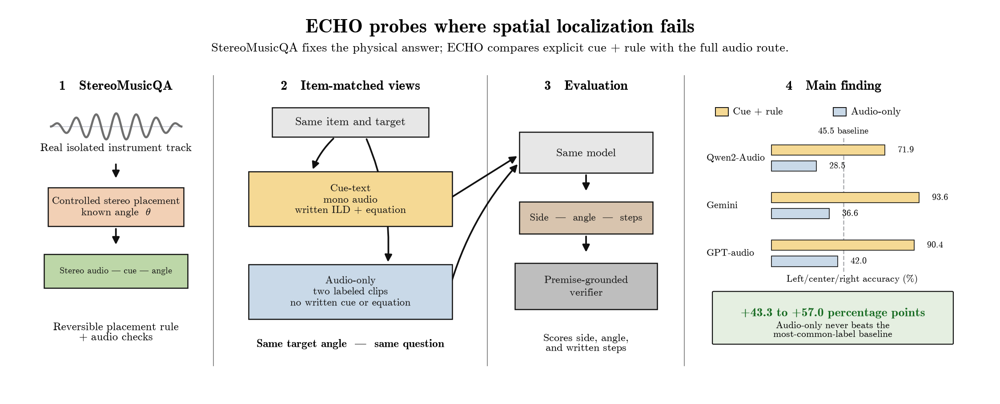

<div align="center">

<a href="https://tai-eval.github.io/cfp/">
  <picture>
    <source media="(prefers-color-scheme: dark)" srcset="https://neurips.cc/static/core/img/neurips-navbar-logo.svg">
    
  </picture>
</a>

<h3><a href="https://tai-eval.github.io/cfp/">NeurIPS 2026 Workshop · TAE (Trust-AI-Eval): Can We Trust AI Evaluation?</a></h3>

<h1>ECHO: Diagnosing Spatial Cue Access in Audio-Language Models</h1>

<b>Daniel Huang</b> ·
<b>Alvin Shen</b> ·
<b>Kyle Xu</b> ·
<b>Aarush Rochakonda</b> ·
<b>Aryan Shrivastava</b><sup>‡</sup>

<br><br>

<a href="https://tai-eval.github.io/cfp/"></a>
<a href="paper/ECHO.pdf"></a>
<a href="#data-setup"></a>
<a href="#headline-results"></a>

<a href="LICENSE"></a>

<br>

<a href="#headline-results">Results</a> ·
<a href="#installation">Installation</a> ·
<a href="#data-setup">Data</a> ·
<a href="#reproduce-evaluation-outputs">Reproduce</a> ·
<a href="#citation">Citation</a>

</div>

ECHO reveals where spatial localization breaks in audio-language models. A model
may be able to reason from a spatial cue once that cue is written down, yet fail
to recover the same evidence from audio. Ordinary end-to-end accuracy hides this
difference because it reports only whether the final answer is correct.

ECHO (Explicit Cue versus Heard Observation) makes the failure measurable by
separating two abilities:

1. **Cue access:** obtaining useful spatial evidence from left and right audio.
2. **Cue use:** converting that evidence into a direction and angle.

StereoMusicQA makes this diagnosis possible with real isolated instrument
recordings placed at known angles using a reversible amplitude-panning rule. The
rendered audio, measured inter-channel level difference (ILD), and correct angle
can all be checked against one another. ECHO then presents every localization
item in two matched conditions:

- **Cue-text:** the model receives mono audio, the measured inter-channel level
  difference (ILD), the louder channel, and the panning equation.
- **Audio-only:** the model receives separately labeled left- and right-channel
  clips, with no written ILD or equation.

The recording, target position, question, model, and scoring rule remain fixed.
What changes is whether the cue and conversion rule are written explicitly or
must be obtained and applied through the audio route. Across 1,045 held-out
items, making the cue and rule explicit improves left/center/right accuracy by
**43.3 to 57.0 percentage points** across Qwen2-Audio, Gemini Flash-Lite, and
GPT-audio. Every audio-only result remains below the most-common-label baseline.

Beyond final accuracy, ECHO includes a premise-grounded verifier that checks
whether a model's written calculation actually follows from its stated cue. An
off-grid audit uses this check to expose an apparently perfect fine-tune as a
21-pair lookup table rather than faithful calculation. Together, the framework,
benchmark, verifier, and audits show why spatial evaluation must measure cue
access, cue use, angle accuracy, and derivation faithfulness separately.



## Headline results

The main experiment evaluates three audio-language models on the same 1,045
held-out items.

| Model | Cue-text accuracy | Audio-only accuracy | Paired gap |
|---|---:|---:|---:|
| Qwen2-Audio | 71.9% | 28.5% | +43.3 pp |
| Gemini Flash-Lite | 93.6% | 36.6% | +57.0 pp |
| GPT-audio | 90.4% | 42.0% | +48.4 pp |

Accuracy here means choosing the correct label among left, center, and right.
Every audio-only result is below the 45.5% most-common-label baseline. Paired
confidence intervals obtained by resampling complete source tracks exclude zero
for all three models.

The remaining analyses show why this distinction matters:

- Correctly identifying the side does not guarantee an accurate angle.
  Cue-text within-5-degree accuracy ranges from 0.4% to 80.7% across models.
- A premise-grounded verifier checks whether a written calculation follows from
  the cue stated in the response, rather than only checking its final answer.
- An off-grid audit found that an apparently perfect fine-tune had memorized 21
  displayed cue-answer pairs. In 189 of 190 off-grid responses, its arithmetic
  did not follow from its own stated cue.
- Dense cue augmentation removes that specific failure signature, but accurate
  interpolation remains an alternative explanation. We therefore do not treat
  the repaired run as proof that the model learned a symbolic algorithm.

## Repository structure

| Path | Purpose |
|---|---|
| `benchmark/` | Benchmark construction, configurations, schemas, splits, and validation |
| `spatialize/`, `cues/` | Audio rendering and spatial-cue measurement |
| `model/` | Qwen2-Audio adapters and fine-tuning utilities |
| `eval/`, `verifier/` | Answer extraction, scoring, and premise-grounded verification |
| `scripts/` | Benchmark, inference, statistics, scoring, and figure entry points |
| `artifacts/` | Released manifests, labels, splits, and rejection records; no audio |
| `experiments/` | Model completions, structured results, and experiment notes |
| `paper/` | Manuscript source, bibliography, figures, and compiled PDF |
| `tests/` | Unit and integration tests |

## Installation

Python 3.10 or newer is recommended.

```bash
python3 -m venv .venv
source .venv/bin/activate
python -m pip install --upgrade pip
python -m pip install -r requirements.txt
```

The requirements cover the signal-processing pipeline, tests, and local
Qwen2-Audio experiments. Hosted-model evaluation may require an additional
provider SDK; see [`docs/models.md`](docs/models.md).

## Data setup

URMP audio is not redistributed in this repository. Download it from its
original distribution and place the extracted dataset at:

```text
data/URMP/
```

Use the isolated `AuSep_*` instrument tracks, not the mixed `AuMix_*`
recordings. See [`docs/data.md`](docs/data.md) for the expected layout.

Build StereoMusicQA v0.2 with:

```bash
python scripts/build_benchmark.py \
  --config benchmark/configs/stereomusicqa_v0.2.json
```

This recreates the benchmark manifests and rendered WAV files under
`artifacts/stereomusicqa_v0.2/`. Generated audio is ignored by Git.

## Reproduce evaluation outputs

Score a saved answer file:

```bash
python scripts/score_benchmark.py \
  --labels artifacts/stereomusicqa_v0.2/test_private_labels.jsonl \
  --answers experiments/2026-08-11-multimodel-comparison/answers_cues_gemini.jsonl \
  --name gemini-cue-text \
  --baselines
```

Recompute the paper's paired bootstrap intervals, class-balanced metrics, and
piece-cluster sensitivity analysis:

```bash
PYTHONPATH=. python scripts/paper_statistics.py
```

Regenerate the paper figures:

```bash
PYTHONPATH=. python scripts/make_paper_figures.py
```

Run the test suite:

```bash
PYTHONPATH=. pytest -q
```

Tests that require an optional URMP fixture are skipped when the corresponding
recording is unavailable.

## Scope

- The main benchmark uses controlled studio amplitude panning, not natural
  head-related transfer functions or a complete simulation of human hearing.
- Left and right channels are delivered as two labeled clips to provide a
  consistent protocol across the tested systems. This is not native stereo
  ingestion.
- The 1,045 test items reuse 19 source tracks from six URMP pieces. Statistical
  intervals therefore resample complete tracks rather than treating every
  rendered item as an independent recording.
- Hosted systems may change over time. Their reported results are single-answer
  measurements of the service versions used in this study, not multi-seed
  averages.

## Paper

Read the full manuscript: [`paper/ECHO.pdf`](paper/ECHO.pdf).

## License

Unless otherwise noted, the code is released under the [MIT License](LICENSE).
URMP source recordings are not included and remain subject to their original
distribution terms.
